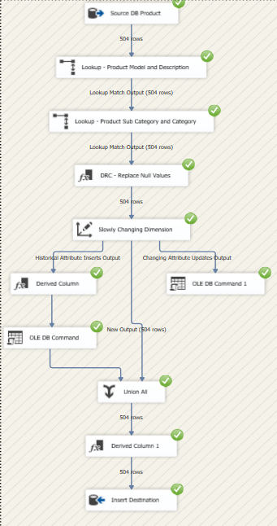
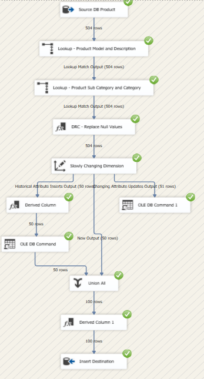
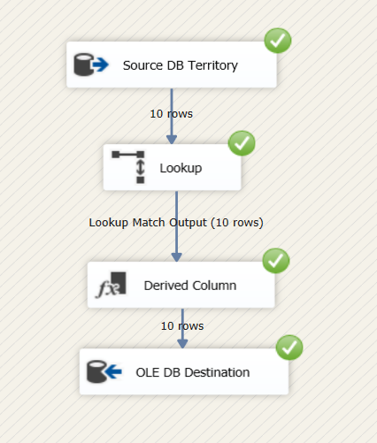
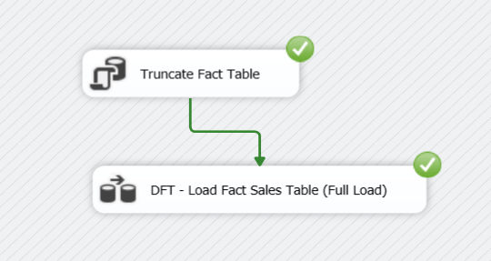
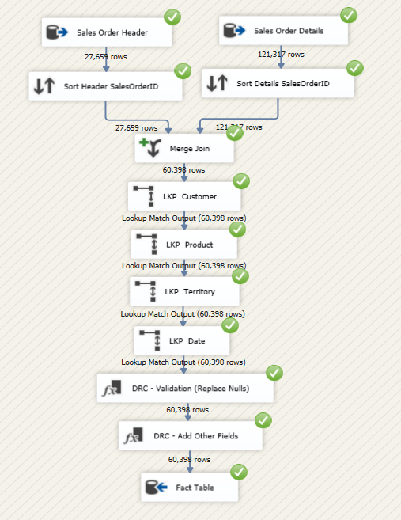
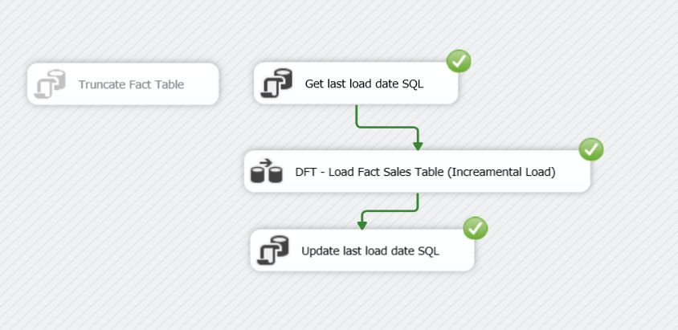

# Sales Data Mart

## Overview:
In this project, a Sales Data Mart was developed using SQL Server Integration Services (__SSIS__) and SQL Server, leveraging the __AdventureWorks2022__ Dataset for online sales analysis. The project involved utilizing __Visual Studio__, SQL Server Integration Services (SSIS), and SQL Server Management Studio (__SSMS__) for project development. 
__Slowly Changing Dimensions__ (SCD) Type 1 and Type 2 techniques were implemented for dimension data management, and a __star schema__ comprising dimension tables (Product, Customer, Territory, and Date) and a central fact table was designed to optimize data analysis. 
Additionally, __six SSIS packages__ were created for building the data mart, and __SQL scripts__ were developed for generating the structure schema of the Sales Data Mart

### ETL_Dim_Product : 

- In the First load, all records have been inserted into the destination database without passing through `any historization`.
- After the initial load, we refined our Product dimension with __SCD Type 1 and Type 2 techniques__. Now, it accurately reflects changes, ensuring our data mart provides valuable insights for decision-making. 

### ETL_Dim_Customer : 

### ETL_Dim_Territory : 
- As part of the project, a __lookup table__ was developed for ingesting territory data with full country names, enhancing the representation of territory data within the Sales Data Mart 

### ETL_Dim_Date : 

### Fact_Sales_Full_Load : 

### Fact_Sales_Increamental_Load :

